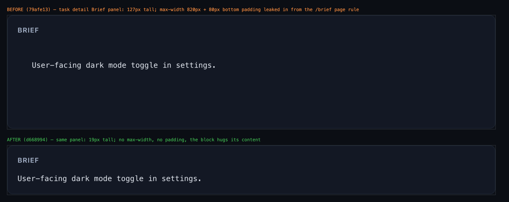
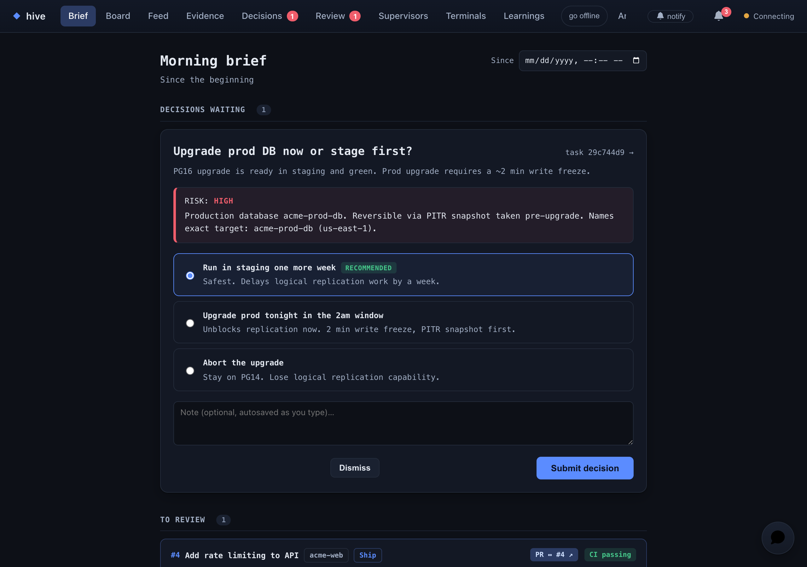

# hive-771 — `.brief` selector collision fix

Ran the real app (hive server on an isolated seeded DB + vite dev) and drove Chromium to both surfaces, once with the base-commit files and once with the fix, measuring computed styles and screenshotting each.

## Task detail → Brief panel (`web/src/views/Task.tsx:434`, `pre.brief`)



| | before (79afe13) | after (d668994) |
|---|---|---|
| `max-width` | 820px | none |
| `padding` | 28px 24px 80px | 0px |
| rendered height (1-line brief) | 127px | 19px |
| `font-family` / `white-space` | ui-monospace / pre-wrap | ui-monospace / pre-wrap |

The panel keeps its mono, pre-wrap typography and now hugs its content instead of carrying ~80px of dead space and a page-width cap.

## `/brief` page container (`web/src/views/Brief.tsx`, now `.brief-page`)



Computed styles are unchanged across the rename: `max-width: 820px`, `padding: 28px 24px 80px`, `font-family: var(--mono)`, `font-size: 12.5px`. `brief-page-before.png` and `brief-page-after.png` are byte-identical (same sha256), so the page render did not shift at all.

## Compiled CSS (`web/dist/assets/index-*.css` from `bun run build`)

```
.brief{font-family:var(--mono);font-size:12.5px;white-space:pre-wrap;word-break:break-word;color:var(--text);margin:0;line-height:1.55}
.brief-page{max-width:820px;margin:0 auto;padding:28px 24px 80px;font-family:var(--mono);font-size:12.5px;line-height:1.55;white-space:pre-wrap;word-break:break-word;color:var(--text)}
```

One `.brief` rule remains (the task-detail `pre`); the page container styles live under `.brief-page`.
